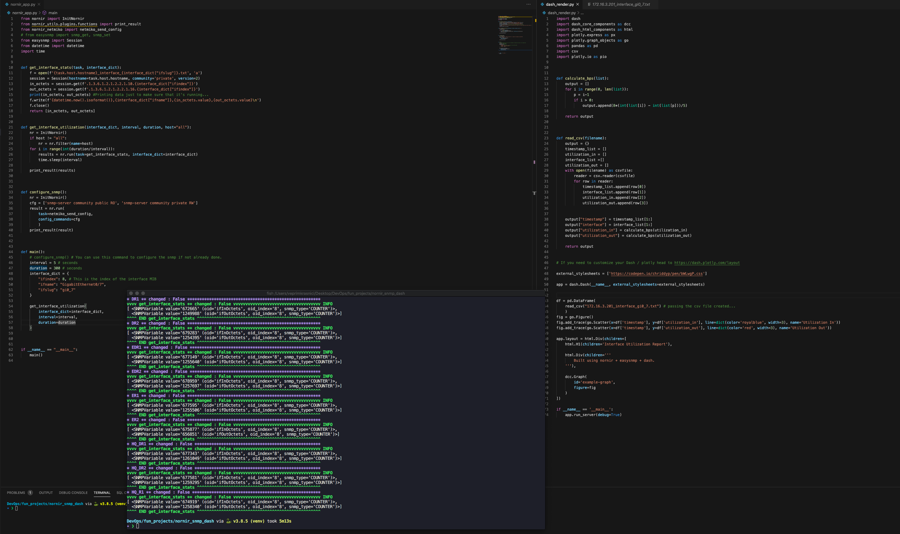
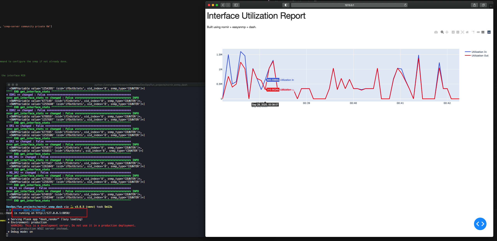

# Interface Graphing using Nornir, EasySNMP and Dash

This repository contains two python files:

*  **nornir_app.py** which can be used to configure SNMP on the host devices and then retrieve interface In/Out octets for a given period and interval
*  **dash_render.py** which you have to configure to read the desired file and then will start a web server and display the results in a line chart

Code view

Graph

Enjoy